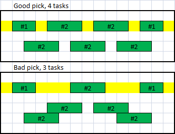

### Attempt 1:
1. Build an array of tasks with `{begin-date, end-data and overlap-count}` (`overlap-count` being the number of other tasks overlapping) (pass1.ml, pass2.ml)  `Array` `Priority queue` `Hashtable` `Sweep line algorithm`
2. Schedule tasks one by one starting from the ones with a lower `overlap-count`. (pass3.ml) `Interval tree`

It does not work after all, result is 1.2% too low vs the best combination.
This is why:
 

### Attempt 2:
- Slow recursive function trying all combination (dumb_impl.ml)
- Too slow above 50-100 tasks
- Does not work, might be a small mistake in the branch pruning

### Attempt 3:
1. In the set of all (remaining) tasks, we know for sure that the one with the smallest end-date is a good pick.
2. We can then pick it in the final set and ignore all the tasks overlapping with this one.
3. Back to 1.

simple_solution.ml `map`